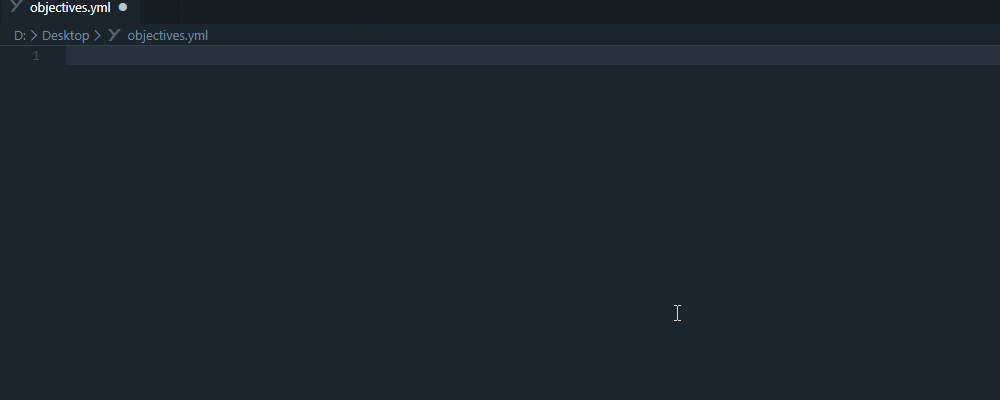

# BetonQuest Code Snippets

    
    <a href="https://github.com/BetonQuest/BetonQuest">
        <!-- TODO Update version for major releases -->
        
    </a>
    
    

**Code snippets version `2.0.0` for BetonQuest version [`1.12`](https://github.com/BetonQuest/BetonQuest/releases/tag/v1.11)**

[BetonQuest](https://github.com/BetonQuest/BetonQuest) is a plugin that allows you to create complex rpg styled quests on your Spigot Minecraft server.  

This extension simplifies the process of creating quests by providing code snippets for all events, conditions and objectives.  
It is a powerful tool for beginners to avoid unnecessary errors and for experienced users to speed up their questing.

## Features

* **Tab competition for all events, conditions and objectives**
* **Suggests optional attributes**
* **Preview with short description from BetonQuest wiki**

## Known Issues

Report new Issues [here](https://github.com/joblo2213/betonquest-code-snippets/issues)

## Release Notes
<!-- TODO Add release notes -->

### 2.0.0

All snippets have been overhauled to work with BetonQuest 1.12. They also now feature proper completion
options. Additionally, conversation snippets have been added.

### 1.0.1

Some updates to the README file and fixed an error in the Folder Event Snippets.

### 1.0.0

A first release that includes a bundle of snippets for all events, conditions and events that are natively supported by BetonQuest.  
Features that need an additional Plugin (documented under [Compatibility](https://betonquest.github.io/BetonQuest/en/latest/)) are not yet supported and will come in a future release.  
